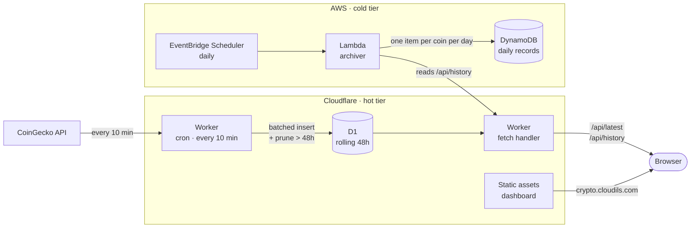

# Serverless Crypto Pipeline

A live dashboard tracking the price, market cap and 24-hour movement of five major cryptocurrencies, updated every ten minutes. Built as a serverless pipeline across Cloudflare and AWS, managed with Terraform, and running entirely within free tiers.

**Live dashboard →** https://crypto.cloudils.com

---

## What it does

Every ten minutes a Cloudflare Worker fetches price, market cap, volume and 24-hour change for Bitcoin, Ethereum, Solana, BNB and Cardano, and writes them to D1. The same Worker serves the dashboard and a small JSON API. Once a day an AWS Lambda reads that window and condenses each day into a permanent record in DynamoDB.



## Why it is shaped this way

The original version of this project ran a seven-service AWS pipeline — Lambda, Kinesis Firehose, S3, Glue, Athena, CloudFront and EventBridge — to move five records every five minutes. It worked, but Firehose and Athena carried most of the cost and nearly all of the operational complexity, for a workload that is a few kilobytes a day.

The rebuild splits the problem by how the data is actually used:

**Cloudflare holds hot data.** Prices are read constantly and only recent ones matter to a chart. D1 keeps a rolling 48-hour window and the cron prunes it on every run, so the database stays a few megabytes and queries stay fast.

**AWS holds cold data.** A daily summary is written once and read rarely. DynamoDB stores one small item per coin per day, indefinitely.

Each tier does the thing it is good at, and neither is doing work the other could do more cheaply.

## Cost

Every service sits inside a permanent free allowance. The figures below are the limits each tier stays within, not estimates.

| Service | Free allowance | Actual use |
|---|---|---|
| Workers requests | 100,000 / day | ~300 |
| Workers cron triggers | 5 | 1 |
| Workers CPU | 10 ms / invocation | static page costs none |
| D1 storage | 5 GB (500 MB per database) | ~2 MB |
| Lambda | 1M requests, 400k GB-s / month | ~30 invocations |
| DynamoDB | 25 GB, 25 RCU, 25 WCU | 1 RCU, 1 WCU, under 1 MB |
| EventBridge Scheduler | 14M invocations / month | ~30 |
| CloudWatch Logs | 5 GB / month | kilobytes, 7-day retention |
| CoinGecko Demo API | 10,000 calls / month | ~4,400 |

Three details do the real work here:

- **DynamoDB is provisioned, not on-demand.** The always-free allowance covers 25 read and 25 write capacity units in provisioned mode only. On-demand bills per request from the first one.
- **The log group is declared in Terraform.** Left alone, Lambda creates it on first invocation with unlimited retention.
- **The dashboard is a static asset.** Page requests never invoke the Worker, so serving it costs no CPU.

## Design decisions

**The chart plots relative change, not price.** The tracked coins span four orders of magnitude. On a shared linear axis, Cardano is a flat line along the bottom and the chart says nothing about it. Each line is percentage change since the start of the window instead, with a per-coin sparkline on each card for absolute shape.

**No charting library.** The charts are hand-drawn SVG. A library would mean a third-party script and a couple of hundred kilobytes on a public page to draw five polylines.

**Terraform manages infrastructure; Wrangler manages deployment.** Terraform owns resources with a lifecycle independent of any deploy — the database, and everything in AWS. Wrangler owns the Worker script, its bindings, the cron trigger and the custom domain. Splitting it this way keeps the two tools from contending over the same resource.

**Ten-minute polling, not five.** The Demo plan allows 10,000 calls a month. Five-minute polling would spend roughly 8,800 of them and leave no headroom for a retry or a redeploy; ten minutes costs about 4,400 and still yields 288 observations per coin across the retained window, which is more resolution than the chart can draw.

**Retention runs inside the write.** Pruning shares the collection cron rather than taking a second trigger.

**The archiver writes every complete day in its window.** One extra write per coin makes a missed run self-healing, instead of leaving a permanent gap in the archive.

## Layout

```text
worker/                       Cloudflare Worker
  src/
    coingecko.ts              upstream contract and normalisation
    db.ts                     D1 queries and retention
    api.ts                    JSON endpoints
    headers.ts                security headers for API responses
    ratelimit.ts              per-IP limit on /api/*
    index.ts                  cron and fetch handlers
  public/
    index.html                the dashboard
    app.js                    chart drawing and polling
    styles.css                the whole stylesheet
    fonts/                    self-hosted Inter and JetBrains Mono
    terms.html, privacy.html  legal pages
    _headers                  the same security headers, for static assets
  migrations/                 D1 schema
  test/                       runs against a real local D1

terraform/
  main.tf                     module wiring
  providers.tf                Cloudflare and AWS
  variables.tf, outputs.tf    root inputs and outputs
  modules/cloudflare/         D1 database
  modules/aws-archive/        DynamoDB, Lambda, scheduler, IAM, logs
  lambda/archiver/            archiver source and tests

.github/workflows/            CI and CodeQL
```

## Running it locally

The dashboard and the API run entirely offline, against a local D1 instance:

```bash
cd worker
npm install
npm run migrate:local          # build the schema
npm run dev                    # http://localhost:8787
```

Only the collection cron needs credentials. To run it locally, put a free [CoinGecko Demo key](https://www.coingecko.com/en/api/pricing) in `.dev.vars` (gitignored) and trigger a scheduled run:

```bash
echo 'COINGECKO_API_TOKEN=CG-...' > .dev.vars
curl "http://localhost:8787/cdn-cgi/local/scheduled"
```

To check the dashboard with data in it, insert a few rows:

```bash
npx wrangler d1 execute crypto-pipeline-prod-prices --local \
  --command "INSERT INTO prices VALUES ('bitcoin', unixepoch(), 77480, 1554879698239, 29950709837, 0.19)"
```

Tests and typecheck:

```bash
npm run typecheck
npm test                       # Worker, against a real local D1
```

The archiver is Python and has its own dependencies:

```bash
cd terraform/lambda/archiver
pip install -r requirements-dev.txt
pytest
```

## Deploying

Terraform needs a Cloudflare API token with `Account → D1 → Edit` and AWS credentials:

```bash
cd terraform
cp terraform.tfvars.example terraform.tfvars   # add your account ID
export CLOUDFLARE_API_TOKEN=...

terraform init
terraform apply
```

Then point the Worker at the database Terraform created and deploy it:

```bash
cd ../worker
# copy the d1_database_id output into wrangler.jsonc
npx wrangler secret put COINGECKO_API_TOKEN   # the Demo key
npm run migrate                # apply the schema remotely
npm run deploy
```

The key is required, not optional. CoinGecko rate limits keyless requests by source IP, and a Worker's egress addresses are shared across Cloudflare and permanently saturated, so an unauthenticated poll returns 429 from the edge on every attempt even though the same request succeeds from a laptop.

## Tech

- **Cloudflare** — Workers, Cron Triggers, D1, Static Assets
- **AWS** — Lambda, DynamoDB, EventBridge Scheduler, CloudWatch
- **Terraform** — both clouds in one root module
- **TypeScript** for the Worker, **Python** for the archiver
- **CoinGecko** Simple Price API, on the free Demo plan (a key is required)

## Security

No long-lived cloud keys live in this repository. Terraform reads its credentials from the environment, state and variable files are excluded from version control, secret scanning and push protection are enabled, GitHub Actions are pinned by commit SHA, and CodeQL runs on every pull request.

The public surface is two read-only `GET` endpoints and a static page. There are no accounts, no sessions and no user data, so the controls that matter are the ones protecting availability and the domain's reputation rather than anyone's records:

- **Rate limiting** on `/api/*`, keyed on the client IP. `/api/history` reads a few thousand rows per call against a daily allowance, so an unlimited endpoint is a way to take the dashboard down for a day, not just to make it slow. Cloudflare counts per machine and reconciles asynchronously, so the effective ceiling is looser than the configured number — a 300-request burst measured against production was cut by roughly a quarter.
- **A strict Content Security Policy** with `default-src 'none'` and no `unsafe-inline`. The stylesheet and script live in their own files specifically so the policy can stay that strict without pinning hashes that break on every edit. Static assets get the same headers through `public/_headers`, since assets are served without invoking the Worker and its code cannot reach them.
- `frame-ancestors 'none'` and `X-Frame-Options: DENY`, because the realistic abuse of a public price dashboard is embedding it in someone else's page.

See [SECURITY.md](SECURITY.md).

## License

[MIT](LICENSE)
