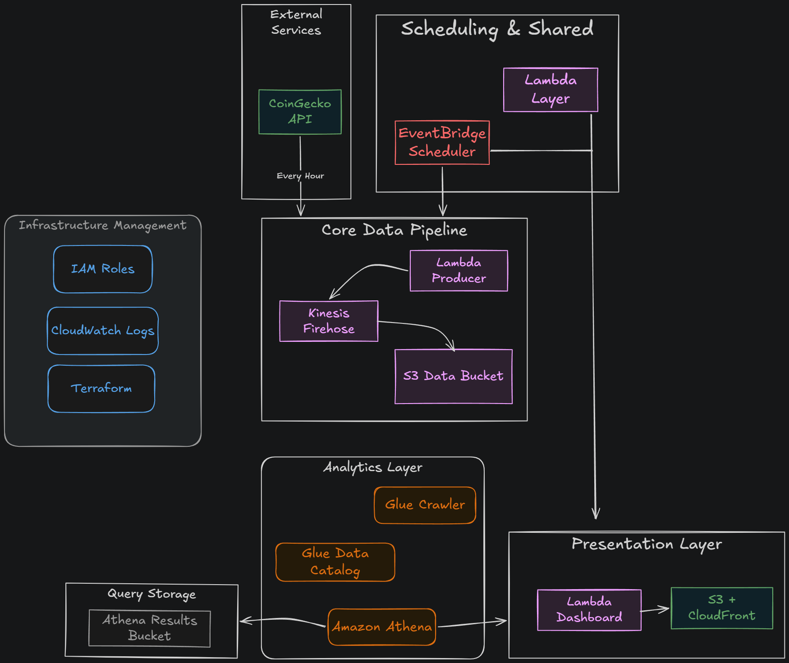

# Serverless Crypto Pipeline

A production-grade, serverless data pipeline that ingests real-time cryptocurrency data from the CoinGecko API, processes it through AWS managed services, and visualizes it in a live public dashboard.

**Live Dashboard →** https://d4us3u1bm2l9r.cloudfront.net/



---

## What it does

Every 5 minutes, a Lambda function fetches price, market cap, volume, and 24h change data for Bitcoin, Ethereum, Solana, BNB, and Cardano. The data flows through Kinesis Firehose into S3, where it gets catalogued by AWS Glue and queried with Athena. Every hour, a second Lambda generates an interactive HTML dashboard and deploys it to CloudFront.

---

## Architecture

| Layer | Service | Role |
|---|---|---|
| Ingestion | Lambda + EventBridge | Fetches crypto data every 5 minutes |
| Streaming | Kinesis Firehose | Buffers and delivers data to S3 |
| Storage | S3 | Stores data partitioned by year/month/day/hour |
| Catalog | AWS Glue | Crawls S3 and maintains schema in Data Catalog |
| Query | Amazon Athena | Runs SQL queries directly on S3 data |
| Visualization | Lambda + CloudFront | Generates and serves the live dashboard |
| IaC | Terraform | All infrastructure managed as code |

---

## Tech stack

- **Runtime** — Python 3.11 / 3.12
- **IaC** — Terraform >= 1.5
- **Data source** — CoinGecko API (free, no API key required)
- **Visualization** — Plotly
- **AWS services** — Lambda, Kinesis Firehose, S3, Glue, Athena, CloudFront, EventBridge, IAM, CloudWatch

```text
Serverless-Crypto-Pipeline/
├── terraform/
│   ├── main.tf                 # Module orchestration
│   ├── providers.tf            # AWS + random providers
│   ├── variables.tf            # Input variables
│   ├── outputs.tf              # CloudFront URL and bucket names
│   └── modules/
│       ├── s3/                 # Data, Athena results, and dashboard buckets
│       ├── iam/                # Roles and policies for all services
│       ├── kinesis/            # Firehose delivery stream
│       ├── lambda/             # Producer and dashboard functions + shared layer
│       ├── glue/               # Crawler and Data Catalog database
│       └── cloudfront/         # CDN distribution for the dashboard
├── lambda/
│   ├── producer/               # Fetches crypto data → Firehose
│   │   └── handler.py
│   ├── dashboard/              # Queries Athena → generates HTML → uploads to S3
│   │   ├── handler.py
│   │   ├── utils.py
│   │   └── template.html
│   └── layers/
│       └── dependencies/       # Shared Python dependencies (plotly, pyathena, numpy)
└── docs/
    └── architecture.png        # Architecture diagram
```

## What I learned

- Designing event-driven pipelines with AWS managed services
- Partitioning data in S3 for cost-efficient Athena queries
- Managing infrastructure as code with Terraform modules
- Applying least-privilege IAM policies across multiple services
- Packaging Python Lambda layers for Linux compatibility
- Deploying serverless dashboards with CloudFront and S3

---
